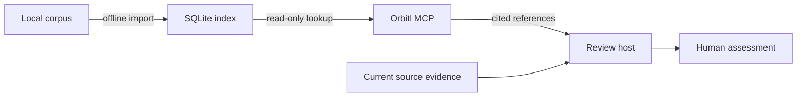

# Architecture

Orbitl serves historical audit references to an MCP host. Retrieval runs locally; the host supplies the model and the current review evidence.

| Module                      | Responsibility                                                              |
| --------------------------- | --------------------------------------------------------------------------- |
| `src/retrieval/findings.ts` | Readonly types, corpus validation, normalization, query terms, and excerpts |
| `src/retrieval/store.ts`    | Transactional indexing and prepared SQLite reads                            |
| `src/retrieval/cli.ts`      | Offline index creation and direct JSON lookup                               |
| `src/mcp/context.ts`        | Citations, context limits, Unicode paging, and assessment prompt text       |
| `src/mcp/server.ts`         | Two MCP tools, one prompt, one resource, and their schemas                  |
| `src/mcp/cli.ts`            | Read-only database lifetime and stdio transport                             |

## Data flow

The optional Python helper reads Parquet, removes exact full-text duplicates, and exports a versioned JSON corpus with a source-dataset hash. It retains the source filename and historical severity, and omits the dedicated PoC field. Descriptions and recommendations may still contain code.

The TypeScript index command validates the corpus and writes metadata, narrative payloads, and an FTS5 index in one transaction. Descriptions and recommendations are searchable; titles remain metadata. An exclusive filesystem link publishes the completed index. Existing destinations survive failed or repeated builds.

Query processes open one existing database read-only with extension loading disabled. Search uses quoted terms and bound SQL parameters. SQLite BM25 ranks results, with finding ID breaking ties. The reader prepares statements once and reuses them for the process lifetime.

## MCP interface

The host starts `dist/mcp/cli.js` with an explicit index path. Stdout carries protocol messages; stderr carries diagnostics. This follows the [MCP host and server model](https://modelcontextprotocol.io/docs/learn/architecture).

`search_audit_references` accepts up to 2,048 JavaScript string units and 64 searchable terms, and returns at most ten cited excerpts. `get_audit_reference` reads a description or recommendation in pages of up to 8,000 Unicode code points. Excerpts stop at their character limit without allocating a full character array. Paging retains only the requested page while counting the section length.

The encoded tool result is capped at 64 KiB before the JSON-RPC envelope. This includes both structured content and its text copy. Search removes trailing results to fit and reports `omittedForBudget`. Oversized pages return an error requesting a shorter page.

Each reference carries a source-dataset hash, finding ID, stable `orbitl:<hash>:<id>` citation, source filename, and historical severity. The `orbitl://index` resource describes the dataset identity and retrieval method. The recorded hash identifies the source snapshot; it does not authenticate later corpus or index edits.

`review_with_references` combines an existing concern, optional supplied evidence, and five references into assessment context. Its encoded result has the same 64 KiB limit and rejects oversized evidence instead of silently truncating it. The host model generates the response.

## Trust and implementation

Corpus text, concerns, and supplied evidence are untrusted data. The server does not execute their code or instructions. It exposes no scanner, network, model, signing, transaction, or report-writing operation. The offline index command is separate from the MCP interface.

Runtime code uses strict functional TypeScript and readonly records. Node supplies SQLite; the MCP SDK and Zod provide protocol and schema handling. The optional Parquet export helper remains Python.

Retrieval is lexical. Historical similarity and severity do not establish applicability to current source. A reviewer must compare prerequisites, cite source evidence, and record a reasoned disposition. The [benchmark](benchmarks/README.md) measures known-item lookup; independent review-quality evaluation remains open.
